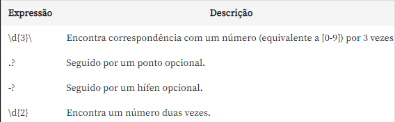
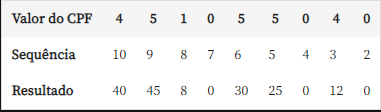
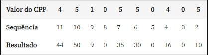

<h1 align="center">Projeto do curso de JavaScript: validando formulários</h1>

## Projeto realizado por: [Thiago Zambelli][1]

  

Formulário de criação de contas para o banco virtual MoniBank.

## Tecnologias utilizadas durante o curso
* JavaScript

## Tecnologias utilizadas no projeto
* HTML
* CSS

## Assuntos abordados:

* Definir tipos para campos de digitação;
* Limitar a quantidade de caracteres em um elemento input;
* Controlar a quantidade mínima de caracteres do input;
* Transformar um campo em obrigatório;
* Utilizar patterns;
* Criar expressões regulares;
* Selecionar vários elementos ao mesmo tempo;
* Construir funções para cada elemento de uma lista;
* Detectar eventos do usuário;
* Importar funções de outros arquivos;
* Verificar CPFs com números repetidos;
* Validar os dígitos verificadores do CPF;
* Transformar fórmulas matemáticas em código;
* Lidar com datas em JavaScript;
* Construir comparações de datas para verificar maioridade;
* Encontrar as validações padrões que existem no JavaScript com o Validity State;
* Interpretar cada tipo de erro;
* Criar mensagens customizadas;
* Remover o comportamento padrão de erro do HTML;
* Mostrar as mensagens customizadas na página;
* Salvar dados no localStorage;
* Iniciar camêra do usuário no navegador;
* Capturar fotografia;
* Lidar com eventos de click;
* Aplicar um fluxo de navegação escondendo e mostrando elementos;
* Inserir novos dados no localStorage.

## Utilização de expressão regular para validar campos: 

* Utilizado principalmente no campo de CPF para ajustar a possibilidade de usos do . ou - como separação de partes do mesmo.

## Validação de CPF utilizando o calculo dos digitos verificadores:
* Verificação do primeiro digito do CPF

* Verificação do Segundo digito do CPF

[1]: https://www.linkedin.com/in/thiagozambelli "Linkedin"